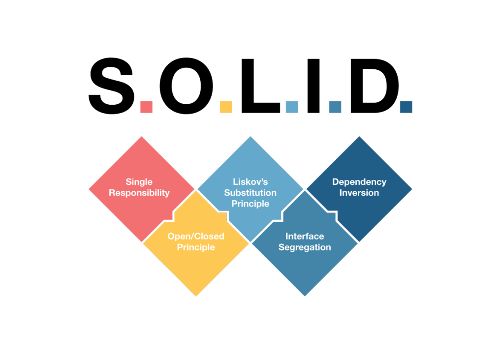

# Princípios Solid

Este repositório tem como objetivo fornecer exemplos práticos e claros que ilustram os princípios do SOLID

Referências:
https://medium.com/desenvolvendo-com-paixao/o-que-%C3%A9-solid-o-guia-completo-para-voc%C3%AA-entender-os-5-princ%C3%ADpios-da-poo-2b937b3fc530

## SRP - Single responsability principle (Principio de responsabilidade única)

O principio de **responsabilidade única** se refere a que uma classe só deve ter uma unica responsabilidade.

Por exemplo uma classe especializada em N coisas chamado comumente de **god class**
pode gerar os seguintes problemas.

* Falta de coesão — uma classe não deve assumir responsabilidades que não são suas
* Alto acoplamento — Mais responsabilidades geram um maior nível de dependências 
  deixando o sistema engessado e frágil para alterações
* Dificuldades na implementação de testes automatizados — É difícil de **“mockar”** esse tipo de classe
* Dificuldades para reaproveitar o código

Um exemplo visto no código é a classe **PedidoGodClass** onda ela pode salvar no banco, exibir, 
enviar notificação de email.

Seguindo o principo seus métodos foram divididos em 4 classes onde cara uma tem sua responsabilidade

* **Pedido** - Responsável pela criação do pedido
* **PedidoViewer** - Responsável por exibir informações sobre o pedido
* **PedidoRepository** - Responsável por fazer interações com o banco de dados.
* **EmailService** -  Responsável por Operações referentes a email.

## OCP - Open-Closed Principle (Principo Aberto-Fechado)